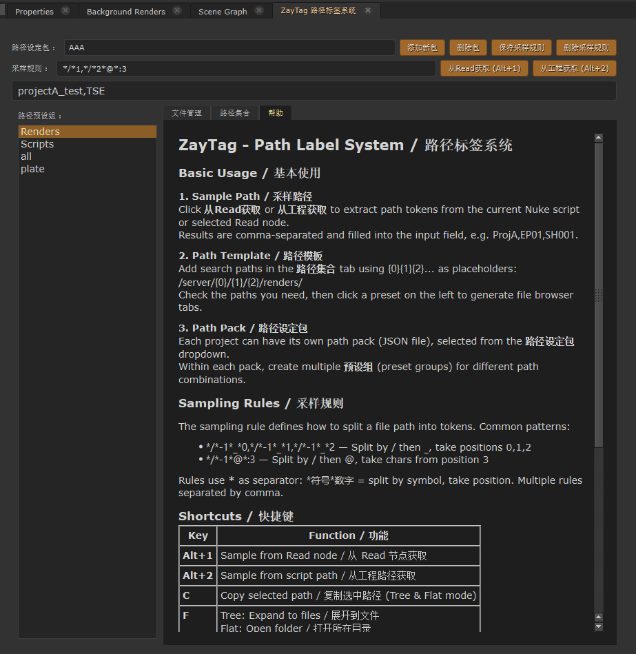

# ZayTag — Nuke Path Label System / Nuke 路径标签系统

> A production-ready file browser and path management tool for [Nuke](https://www.foundry.com/products/nuke). — 面向 Nuke 的生产级文件浏览器与路径管理工具。

Tag your project paths with tokens, browse renders with sequence-aware views, and drag files directly into the node graph.
用令牌标记项目路径，以序列感知视图浏览渲染文件，拖拽即可导入节点图。

Compatible with **Nuke 13 – 16+** and both **PySide2 & PySide6**. / 兼容 Nuke 13–16+，同时支持 PySide2 和 PySide6。

---

## Screenshot / 截图



---

## Features / 功能特性

### Path Sampling / 路径采样
- **Sampling Rules / 采样规则** — Editable dropdown with save/delete for managing custom parsing rules. Rules use `*` as separator to define split-by-symbol and take-by-position operations. 可编辑下拉菜单，支持保存/删除自定义解析规则。
- **Token Extraction / 令牌提取** — `Alt+1` samples from a selected Read node; `Alt+2` samples from the current Nuke script path. Extracted tokens fill the input field as comma-separated values. 从 Read 节点或工程路径提取路径令牌，逗号分隔填入输入框。
- **Input Validation / 输入校验** — Warning dialogs when no Read node is selected or no script is saved, instead of silent crashes. 无选中节点或未保存工程时弹窗提示，不再静默崩溃。

### Path Management / 路径管理
- **Path Packs / 路径设定包** — JSON-based per-project path configurations. Add/delete project packs via buttons. 基于 JSON 的按项目路径配置，可通过按钮添加/删除包。
- **Preset Groups / 路径预设组** — Within each pack, save checked paths as named preset groups. Click a preset to auto-select its paths. 每个包内可将勾选路径保存为预设组，点击预设自动勾选对应路径。
- **Path Collection / 路径集合** — Checkbox-based path list. Right-click menu for Add / Delete / Edit. Double-click to edit a path. 带复选框的路径列表，右键菜单添加/删除/编辑，双击编辑路径。
- **Placeholder System / 占位符系统** — Use `{0} {1} {2} ...` in path templates, replaced by sampled tokens at runtime. 路径模板中使用占位符，运行时替换为采样令牌。

### File Browser / 文件浏览器
- **Three View Modes / 三种浏览模式**
  - *Tree / 树* — Traditional folder tree view. 传统文件夹树。
  - *All Files / 所有文件* — Flat recursive file list. 扁平递归文件列表。
  - *Sequences / 序列整理* — Auto-group frame sequences into single entries with frame range and missing-frame detection (e.g. `render.%04d.exr 1001-1100`). 自动合并帧序列，显示帧范围与缺失帧。
- **Tabbed Browsing / 标签页浏览** — Each generated path opens as a closable tab with its own path bar and refresh button. 每条路径打开一个可关闭标签页，带路径栏和刷新按钮。
- **Drag & Drop / 拖拽导入** — Drag files/sequences from any view directly into the Nuke Node Graph to create Read nodes. 从任意视图拖拽文件到节点图创建 Read。
- **Right-Click Menu / 右键菜单**
  - *Tree mode:* Copy Path / Open File / Expand Folder / Collapse Folder / Expand to Files / Import Folder as Read
  - *Flat / Sequence mode:* Copy Path / Open in Explorer / Import as Read

### Cross-Platform / 跨平台
- **System Path Conversion / 系统路径转换** — Configure paths in one system's format (e.g. Windows `X:/projects/`). The tool auto-converts paths when running on a different OS (e.g. Linux → `/media/X/projects/`) via configurable `_systemMap` rules in the path pack JSON. 按一种系统格式配置路径，通过 `_systemMap` 映射规则在不同系统间自动转换。

### Usability / 易用性
- **Keyboard Shortcuts / 快捷键**
  - `Alt+1` — Sample from Read node / 从 Read 节点获取
  - `Alt+2` — Sample from script path / 从工程路径获取
  - `C` — Copy selected path (Tree & Flat) / 复制选中路径
  - `F` — Expand to files (Tree) / Open folder (Flat) / 展开到文件 / 打开目录
  - `W` — Collapse folder (Tree) / 闭合文件夹
- **Session Memory / 会话记忆** — Automatically remembers last path pack, sample rule, and preset group across sessions. 自动跨会话记忆上次的路径包、采样规则和预设组。
- **Dark UI / 暗色界面** — Warm amber theme matching Nuke's native style. Editable combo boxes have visible orange dropdown buttons to distinguish from read-only controls. 暖琥珀色调匹配 Nuke 原生风格，可编辑下拉框有橙色下拉按钮区分。
- **Built-in Help / 内置帮助** — Bilingual (Chinese/English) help tab with full feature documentation. 中英双语帮助标签页。

---

## Installation / 安装

### Quick Install / 快速安装

```bash
# Clone into your .nuke directory / 克隆到 .nuke 目录
cd ~/.nuke
git clone https://github.com/ZayvinL/ZayTag.git ZaneTpack/pipline_ZayTagPath
```

### Nuke Startup / Nuke 启动配置

Add to `~/.nuke/init.py` or `~/.nuke/ZaneTpack/init.py` / 添加到 Nuke 启动脚本：

```python
import nuke
nuke.pluginAddPath("./ZaneTpack/pipline_ZayTagPath")
```

Restart Nuke. Find **ZayTag > ZayTag 路径标签系统** in the Nodes toolbar menu, or run in the Script Editor:
重启 Nuke，在节点工具栏菜单中找到 **ZayTag > ZayTag 路径标签系统**，或在脚本编辑器中运行：

```python
import ZayWPanel
ZayWPanel.runshow()
```

### Requirements / 运行环境

- Nuke 13.0+
- PySide2 or PySide6（bundled with Nuke / 随 Nuke 自带）
- No external Python packages required. / 无需额外 Python 包。

---

## Configuration / 配置

### Data Locations / 数据存储位置

| File / 文件 | Purpose / 用途 |
|---|---|
| `SampleRuler.json` | Saved sampling rules / 保存的采样规则 |
| `UserSession.json` | Last-used selections (auto-generated) / 上次使用的选择（自动生成） |
| `PathPackSet/*.json` | Path packs per project / 每个项目的路径包 |

These are stored under the plugin directory by default. 默认存储在插件目录下。

### Studio Deployment / 工作室部署

For multi-user environments, redirect data paths to a shared network location by editing `ZayWPanel.py`:
多用户环境可将数据路径指向共享网络位置，编辑 `ZayWPanel.py`：

**Sample rules** (line ~830) / 采样规则存储：

```python
cc = "//studio_server/share/ZayTag/"
```

**Path packs** (line ~849) / 路径包存储：

```python
cc = "//studio_server/share/ZayTag/PathPackSet/"
```

All config files are created with read/write permissions for all users (`0o666` for files, `0o777` for directories).
所有配置文件创建时均设置为所有用户可读写权限。

### System Path Conversion / 系统路径转换

The `xitongchange()` function in `ZayWPanel.py` is called automatically when generating file browser tabs. It detects the current operating system and converts path prefixes accordingly, so you only need to maintain one set of paths per project — they adapt to Windows, Linux, or macOS automatically.

`xitongchange()` 函数在生成文件浏览器标签页时自动调用，检测当前操作系统并转换路径前缀。只需维护一套路径即可在 Windows、Linux、macOS 间自动适配。

Edit the function body in `ZayWPanel.py` to define your own platform-specific path mappings.
在 `ZayWPanel.py` 中编辑该函数以定义自己的平台路径映射规则。# 先试试直接 push，看具体报什么错
git push origin main

---

## Usage / 使用指南

### 1. Sample Path / 采样路径

Select a Read node and press `Alt+1` (or click **从Read获取**).  
Or press `Alt+2` (or click **从工程获取**) to sample from the current Nuke script.

The sampling rule extracts path tokens, filling the input field with comma-separated values like `ProjA,EP01,SH001`.

选中 Read 节点按 `Alt+1`（或点击从Read获取），采样规则提取路径令牌并填入输入框。

**Sampling rule format / 采样规则格式：**

```
*/*-1*_*0,*/*-1*_*1,*/*-1*_*2
```

| Symbol / 符号 | Meaning / 含义 |
|---|---|
| `*` | Separator between operations / 操作分隔符 |
| `symbol*N` | Split by symbol, take position N / 按符号拆分，取第 N 位 |
| `@*N` | Take character at position N (no split) / 按字符位置取值（不拆分） |
| `@*A:B` | Slice characters from A to B / 截取字符 A 到 B |
| `,` | Separate multiple rules (one token each) / 分隔多条规则 |

Type custom rules directly into the editable dropdown, or use **保存采样规则** / **删除采样规则** to manage presets.
可直接在下拉框中输入自定义规则，或用保存/删除按钮管理预设。

### 2. Set Up Path Packs / 设置路径包

Use **添加新包** to create a project-specific path pack (JSON file). Switch between packs via the dropdown.
用添加新包创建项目专属路径包，通过下拉菜单切换。

### 3. Configure Paths / 配置路径

In the **路径集合** tab, right-click to add search paths with `{0}{1}{2}` placeholders:
在路径集合页面右键添加查找路径：

```
X:/projects/{0}/{1}/{2}/renders/
```

Check the paths you need, then click **保存设定** to save them as a preset group.
勾选需要的路径，点击保存设定存为预设组。

### 4. Open File Browser / 打开文件浏览器

Click a preset group in the left panel — file browser tabs are generated automatically for each checked path.
点击左侧预设组，自动为每条勾选的路径生成文件浏览器标签页。

### 5. Browse & Import / 浏览与导入

- Switch view modes via the dropdown: 树 / 所有文件 / 序列整理
- Use keyboard shortcuts or right-click menus
- Drag files directly into the Nuke Node Graph to create Read nodes
- Close tabs via the X button

---

## Sampling Rule Examples / 采样规则示例

| Rule / 规则 | Input / 输入 | Output / 输出 |
|---|---|---|
| `*/*1,*/*2,*/*3` | `/server/ProjA/EP01/SH001/` | `ProjA,EP01,SH001` |
| `*/*-1*_*0,*/*-1*_*1` | `/path/to/file_proj_ep_v001.exr` | `proj,ep` |
| `*/*-1*@*:3` | `/path/to/abc_def_v001.exr` | `abc_def_v001.exr` |
| `*/*0,*/*-1*_*2` | `/server/ProjA/file_EP01_SH002.exr` | `ProjA,SH002` |

---

## Project Structure / 项目结构

```
pipline_ZayTagPath/
├── ZayWPanel.py          # Main window: path packs, sampling, tabs, help / 主窗口
├── tree_widgets.py       # Tree view, flat list, sequences, drag-drop, context menus / 树与列表控件
├── ZaySplit.py           # String splitting engine for path parsing / 字符串拆分引擎
├── ZayTagPath.py         # Backward-compat entry point / 向后兼容入口
├── _qt.py                # PySide2 / PySide6 compatibility layer / Qt 兼容层
├── CurrentPath.py        # Path resolution helpers / 路径解析辅助
├── RWJson.py             # JSON read/write with permission handling / JSON 读写
├── menu.py               # Nuke menu registration / Nuke 菜单注册
├── SampleRuler.json      # Saved sampling rules / 采样规则配置
├── UserSession.json      # Last-used selections / 会话记忆
├── PathPackSet/          # Per-project path pack JSON files / 项目路径包数据
│   ├── 项目A.json
│   └── 项目B.json
└── README.md
```

---

## Credits / 致谢

- **Author / 作者：** LIUXIAOBO (刘晓波)
- **GitHub：** [ZayvinL](https://github.com/ZayvinL)
- **Original concept / 原始概念：** LIUXIAOBO (刘晓波)

## License / 许可

Copyright 2026 LIUXIAOBO (刘晓波).

Licensed under the Apache License, Version 2.0. See [LICENSE](./LICENSE) for the full license text.
See [NOTICE](./NOTICE) for copyright attribution.
